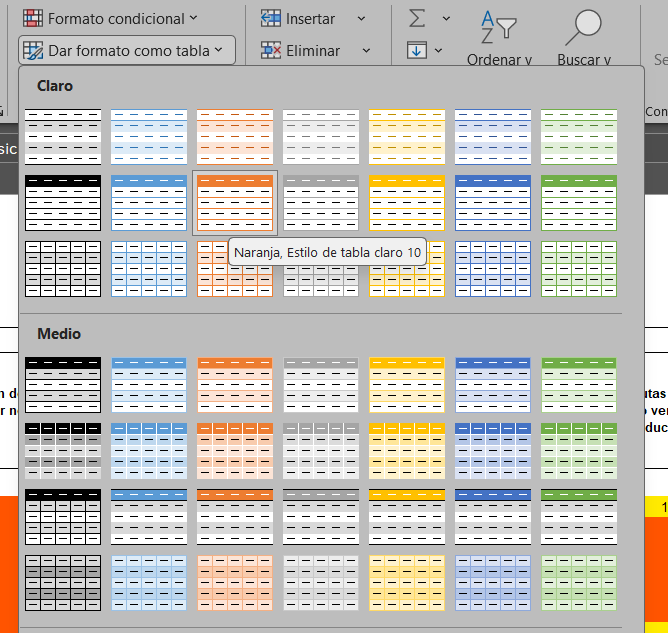
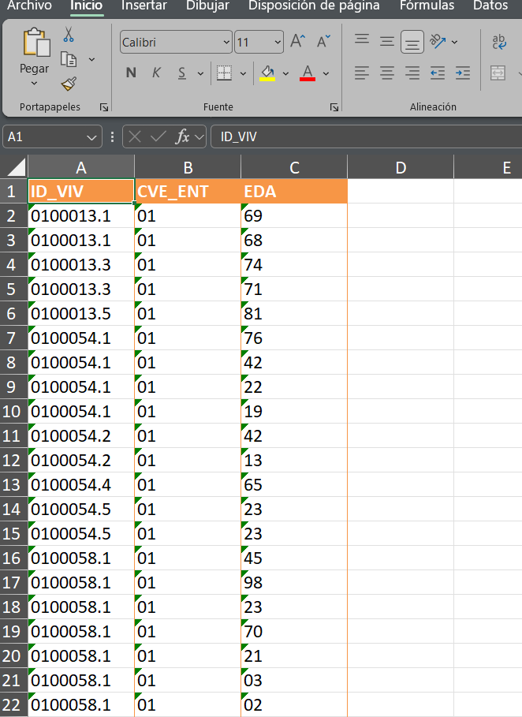
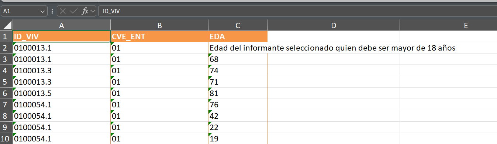
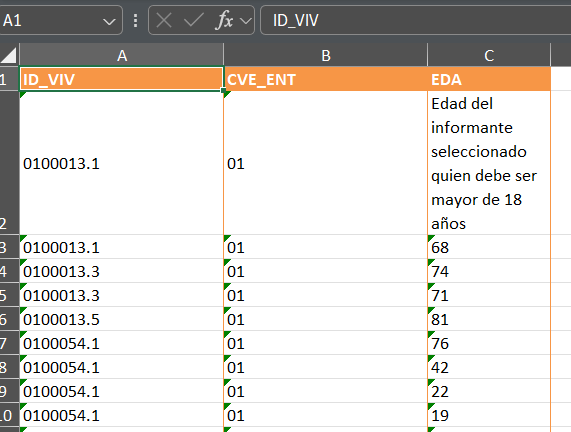
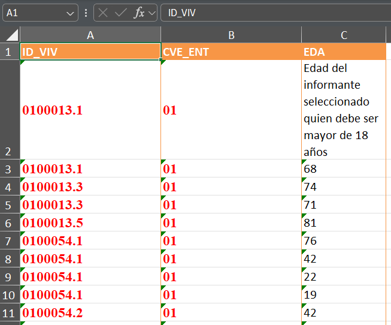

{fig-alt="Alejandro Sánchez Peralta, Head of Department." fig-align="left" width="170"}

Cuando se termina la fase de procesamiento de datos o incluso el análisis exploratorio de un conjunto de datos es usual que se entreguen resultados en un formato que resulte familiar a un público amplio. Partiendo de archivos en R uno podría optar por el archivo en formato *csv*, sim embargo esto puede no resultar tan práctico por ser muy básico y requerir más trabajo que puede automatizarse.

Una alternativa para tratar con esta situación es usar el paquete *openxlsx* de R que, además de permitir importar y exportar datos de Excel, contiene varias funciones para trabajar con variedad de **estilos de tablas y formatos, junto con la manipulación de datos celda por celda,** lo que resulta especialmente útil si estás interesado en crear plantillas.

Dentro de las bondades de estas herramientas están poder emplear estas plantillas para re-hacer cuantas veces sea requerido un archivo con datos actualizados combinando este lenguaje de programación con los diferentes estilos condicionales de Excel, o generar un gran volumen de archivos de manera más eficiente que haciéndolo directamente en Excel.

### Descarga de archivos desde una URL

Para iniciar con un caso real se descargan algunas bases de datos desde el sitio web del INEGI. En este caso de la Encuesta Nacional de Acceso a la Información y Protección de Datos Personales (ENAID). Para esto ponemos una función que descarga los archivos *zipeados*, los descomprime y posteriormente borra la carpeta comprimida.

```{r}
descarga_zip = function (url, descarga, dir_descomprimido, borra_zip) 
{
    download.file(url, destfile = descarga, mode = "wb")
    unzip(zipfile = descarga, exdir = dir_descomprimido)
    if (borra_zip == FALSE) {
        print("Se almacenan el file en formato .ZIP")
    }
    else {
        print("Se borraron los files zipeados")
        unlink(descarga)
    }
}

descarga_zip(url="https://www.inegi.org.mx/contenidos/programas/enaid/2019/microdatos/enaid2019_bd_dbf.zip",
             descarga = "D:/OneDrive - INEGI/Documents/varios/plantillas_personalizadas/datos/dataset.zip", 
             dir_descomprimido = "D:/OneDrive - INEGI/Documents/varios/plantillas_personalizadas/datos/",
             borra_zip = TRUE)

```

Hecho lo anterior vamos a tomar alguna de las tablas para visualizar su contenido y comenzar a trabajar con ella.

```{r}
datos = foreign::read.dbf("D:/OneDrive - INEGI/Documents/varios/plantillas_personalizadas/datos/ENAID_CS.dbf")
head(datos)
```

Vamos a tomar solo algunas variables con el propósito de ilustrar la generación de una plantilla solo para los datos muestrales.

```{r}
datos = datos[,c("ID_VIV", "CVE_ENT", "SEXO", "EDA", "FAC_VIV")]
```

### Generando plantillas con *openxlsx*

Se crea primero un libro de Excel con el comando *createWorkbook*

```{r}
library(openxlsx)
mi_wb = createWorkbook()
```

Hecho esto se van a crear las pestañas de nuestro libro de trabajo. Por cada pestaña creada se debe poner el nombre correspondiente. Pensemos así en el caso de tener solo dos pestañas en nuestro Excel y que se llamarán: "EDAD_INF" y "PONDERADORES".

```{r}
addWorksheet(mi_wb, sheetName = "EDAD_INF")
addWorksheet(mi_wb, sheetName = "PONDERADORES")
```

En nuestro caso únicamente pondremos datos en la hoja llamada EDAD_INF. Los parámetros que se van a usar son el nombre del libro de trabajo, la hoja y el cuadro de datos que se va a colocar. Adicionalmente se despliegan algunos otros parámetros pero el que resulta más relevante en este momento es el de estilo de tabla *tableStyle*

```{r}
writeDataTable(wb = mi_wb, 
               sheet = "EDAD_INF",
               x = datos[1:40,c("ID_VIV", "CVE_ENT","EDA")],  # la tabla que queremos escribir en el Excel, solo los primeros 40 registros
               tableStyle = "TableStyleLight14", # estilo de la tabla
               startRow = 1, startCol = 1,
               colNames = TRUE,
               bandedCols = TRUE,
               bandedRows = FALSE,
               withFilter = FALSE, 
               # keepNA = TRUE, 
               # na.string = "sin datos"
)
```

En excel se puede observar en el apartado de *Inicio\>Estilos\>Dar formato como tabla* , un número que hace referencia al color. En este caso elegimos uno denotado por el número14 (puede variar el color dependiendo de la versión de Office) . Si pasas el cursor por las diferentes tablas podrás observar lo que menciono.

{width="504"}

El libro de trabajo puede guardarse cuando tu desees para observar cómo se ha guardado la información y la manera en la que aparece el cuadro de datos. Es una buena forma de saber si visualmente sirve a tus intereses lo que acabas de hacer.

```{r}
# guardar
saveWorkbook(mi_wb, 
             "datos/tabla_datos.xlsx",
             overwrite = TRUE)

```

Al momento la información que hemos guardado se ve así:

{width="531"}

### Cambiando el ancho de las columnas

Es posible que los datos no se visualicen bien o que el nombre de alguna columna no sea del tamaño adecuado y deba ser más ancho. Para esto vamos a emplear el comando *setColWidths.* En este caso suelen usarse vectores para indicar a qué columnas vamos a cambiar el tamaño. De igual manera en un vector se pone el ancho requerido.

Para ejemplificar de una forma mucho más visual este proceso cambiemos el contenido de una de las celdas de nuestro cuadro de datos antes de cambiar el ancho.

```{r}
# se modifica el texto de la celda
writeData(mi_wb, sheet = 1, x = "Edad del informante seleccionado quien debe ser mayor de 18 años", startCol = 3, startRow = 2, colNames = FALSE)

# ancho de columnas
setColWidths(wb = mi_wb, sheet = 1,
             cols = c(1, 2, 3,
                      4, 5, 6),
             widths = c(22, 22, 13,
                        30, 30, 30)
)


```

Véase que el texto sale de la celda C2 y aunque se modificó el ancho esto se mira raro.

{width="639"}

Para resolver esto desde R creamos un estilo que se aplicará a las celdas para que el texto se acomode de una manera adecuada. Usamos entonces la instrucción *addStyle* y *createStyle*. Este proceso puede hacerse por separado dependiendo de la complejidad del estilo que se está definiendo

```{r}
mi_estilo = createStyle(wrapText = TRUE, valign = "center", halign = "left" )

addStyle(wb = mi_wb, 
         sheet = 1, #puse el número de la hoja en lugar del nombre 
         style = mi_estilo, 
         rows = 1:nrow(datos)+1, 
         cols = c(1:3), 
         stack = TRUE, gridExpand = T)  


```

Ahora se tiene la tabla en esta forma.

{width="390"}

### Estilo de texto para las celdas

Tal como se menciona arriba, se pueden definir los estilos de manera separada para aplicarlos a determinadas celdas. Pero en este caso es importante definir los argumentos `stack = TRUE, gridExpand = T` para que los estilos se sumen en vez de reemplazarse.

```{r}
# celdas en negrita
addStyle(wb = mi_wb, 
         sheet = 1,
         style = createStyle(textDecoration = "BOLD", fontName = "Times New Roman", fontSize = 12, fontColour = "red" ), 
         rows = 1:nrow(datos)+1, 
         cols = c(1, 2), 
         stack = TRUE, gridExpand = T)
saveWorkbook(mi_wb, 
             "datos/tabla_datos.xlsx",
             overwrite = TRUE)
```

Aquí hemos aplicado el estilo de poner negritas a las primeras dos columnas y la fuente Times New Roman, de tamaño 12.

{width="406"}
