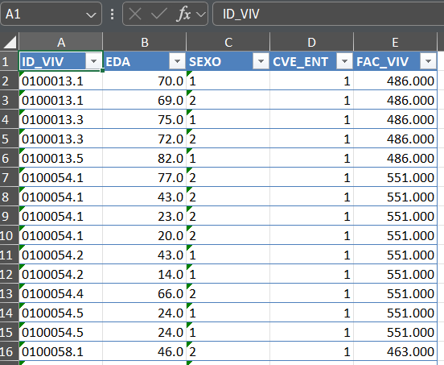
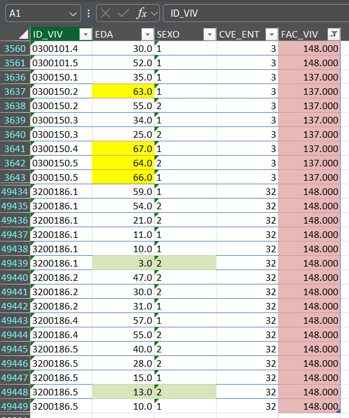

### Formatear variables numéricas

Cuando se presentan datos provenientes de distintas fuentes es necesario ajustar el formato de acuerdo con sus fuentes. Por ejemplo números decimales o divisas. Esto se consigue definiendo un estilo que incluya el formato de los números *createStyle(numFmt = "0.00")*, que hace referencia a un número con dos cifras decimales.

Vamos a crear otro libro para llevar a cabo este ejemplo

```{r}
mi_wb = createWorkbook()
addWorksheet(mi_wb, sheetName = "Edad_numerica")
datos = foreign::read.dbf("D:/OneDrive - INEGI/Documents/varios/plantillas_personalizadas/datos/ENAID_CS.dbf")
datos = datos[,c("ID_VIV","EDA", "SEXO","CVE_ENT", "FAC_VIV")]
datos |> head()
```

Nótese en particular que la variable CVE_ENT tiene ceros a la izquierda, lo que puede resultar en algún error. Podemos modificar el formato de las variables desde R de la siguiente manera.

```{r}
l_var = c("EDA", "CVE_ENT", "FAC_VIV")
for(i in l_var){datos[[i]] =  as.numeric(datos[[i]])}
class(datos[["EDA"]])
```

Una vez que nuestras variables tienen el formato requerido se pueden poner otros atributos para el cuadro de datos con el que se esté trabajando.

```{r}
writeDataTable(wb = mi_wb,
               sheet = "Edad_numerica",
               x = datos)

addStyle(wb=mi_wb, "Edad_numerica",
         style = createStyle(numFmt = "0.0"), 
         rows = 1:nrow(datos)+1, cols = c(2),
         stack = TRUE, gridExpand = TRUE)

addStyle(wb=mi_wb, "Edad_numerica",
         style = createStyle(numFmt = "0.000"), 
         rows = 1:nrow(datos)+1, cols = c(5),
         stack = TRUE, gridExpand = TRUE)


```

Ahora las columnas de edad (EDA) y el FAC_VIV tienen decimales.

{width="477"}

### Estilo condicional

Los estilos se aplican indicando la celda (renglón y columna) que nos interesa modificar. Es decir, que si se busca modificar la celda A12, la columna es 1 y el rengón es 12. Y dado que en R se puede saber el renglón en donde se ubican valores que cumplen con determinada condición para alguna variable, es sencillo aprovechar la lógica mencionada arriba para aplicar estilos que ahora dependan de los valores. Esto es a lo que se denomina formato condicional.

Si nos fijamos en la distribución de frecuencias de la variable FAC_VIV podemos observar que hay valores entre 130 y 150:

```{r}
datos[["FAC_VIV"]] |> table() |> head()
```

Empleando el comando *which* de R podemos conocer su ubicación en el vector de datos.

```{r}
which(130 < datos[["FAC_VIV"]] & datos[["FAC_VIV"]] < 150)
```

Una vez obtenida esta información podemos aplicar algún estilo para diferenciarlos dentro de nuestra tabla. Esto es útil porque puede verse que varios de estos valores están cerca de la posición 50 000, lo que podría dificultar su búsqueda manual.

Definamos entonces un estilo que ponga relleno y borde a las celdas en el cuadro de datos que estamos manejando, pero solamente a las posiciones que se han señalado arriba.

```{r}
 
addStyle(wb = mi_wb, "Edad_numerica",
         # crear estilo de color de relleno
         style = createStyle(fgFill = "#E6B8B7",
                             border = c("top", "bottom"),
                             borderColour = c("#DA9694", "#DA9694")),
         # filas a las que se va a aplicar el estilo
         rows = which(130 < as.numeric(datos[["FAC_VIV"]]) & as.numeric(datos[["FAC_VIV"]]) < 150)+1, # + 1 para saltarse la primera fila
         cols = 5, 
         stack = TRUE, gridExpand = T)

# estilo para edades mayores a 60 años
addStyle(wb = mi_wb, "Edad_numerica",
         style = createStyle(fgFill = "yellow",  
                             border = c("top", "bottom"),
                             borderColour = c("#DA9694", "#DA9694")),
         rows = which(as.numeric(datos[["EDA"]])> 60)+1, 
         cols = 2, 
         stack = TRUE, gridExpand = T)

# un tercer estilo para mujeres menoresde 18 años
addStyle(wb = mi_wb, "Edad_numerica",
         style = createStyle(fgFill = "#D7E4BC",
                             border = c("top", "bottom"),
                             borderColour = c("#C4D79B", "#C4D79B")),
         rows = which(datos[['EDA']]<18 & as.numeric(datos[["SEXO"]])%in%2)+1, 
         cols = 2:3, 
         stack = TRUE, gridExpand = T)


```

Podemos ver entonces cómo es que se aplicó el formato condicional a las celdas que cumplen con los filtros. En verde mujeres menores de 18 años; en amarillo pobación mayor de 60 años y en color rosa los factores menores de 150.

{width="479"}

### Guardando el libro con la plantilla

Este proceso se puede llevar a cabo en cualquier momento, pero una vez que consideres tener lo que ocupas en la plantilla lo salvas al final.

```{r}
saveWorkbook(mi_wb, "datos/tabla_datos2.xlsx", overwrite = TRUE)
```

### Miscelánea

A veces puede requerirse modificar la altura de las celdas o bien podriamos requerir agregar muchas hojas o quizás copiar una hoja específica. Esto es sencillo con los siguientes chunks

```{r}
# Cambiar altura de celdas
setRowHeights(mi_wb, "Edad_numerica",         
              rows = c(1,3),          
              heights = c(33,33))

# Agregar hojas 
nom_hojas = c("Datos_1", "Datos_44", "Central")
for(i in nom_hojas ){addWorksheet(mi_wb, sheetName = i)}

# Copiar una hoja
cloneWorksheet(mi_wb, sheetName = "Edad_bis", clonedSheet = "Edad_numerica")

saveWorkbook(mi_wb, "datos/tabla_datos2.xlsx", overwrite = TRUE)

```
